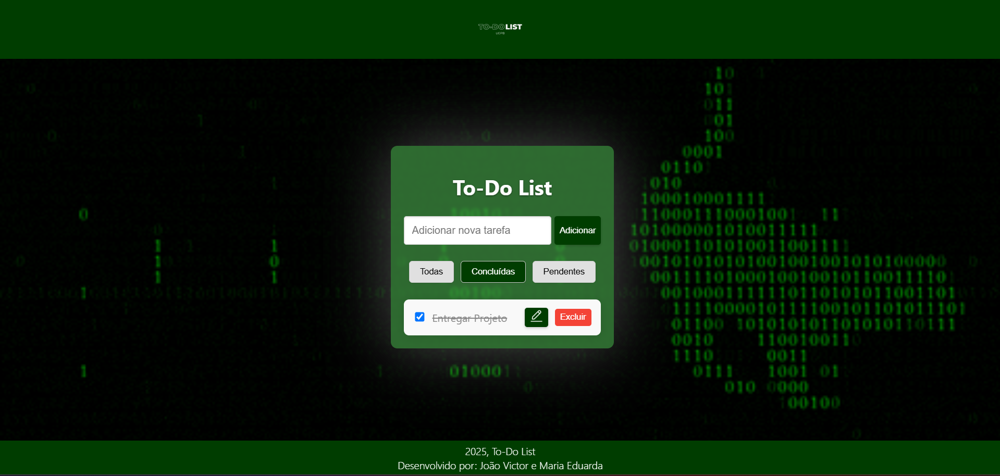

# To-Do-List

Projeto Final da Disciplina de Interface Gráfica

## Descrição

Este é um aplicativo de lista de tarefas (To-Do List) desenvolvido em React, utilizando Redux para gerenciamento de estado global. O objetivo é permitir ao usuário adicionar, editar, remover, filtrar e marcar tarefas como concluídas de forma simples e intuitiva.

## Funcionalidades

- Adicionar novas tarefas
- Editar tarefas existentes
- Marcar tarefas como concluídas ou pendentes
- Excluir tarefas
- Filtrar tarefas por: Todas, Concluídas e Pendentes
- Interface animada com Framer Motion

## Tecnologias Utilizadas

- [React](https://reactjs.org/)
- [Redux](https://redux.js.org/)
- [React Redux](https://react-redux.js.org/)
- [Framer Motion](https://www.framer.com/motion/)
- [Jest](https://jestjs.io/) e [Testing Library](https://testing-library.com/) para testes

## Instalação

1. Clone o repositório:
   ```sh
   git clone https://github.com/seu-usuario/seu-repositorio.git
   ```
2. Acesse a pasta do projeto:
   ```sh
   cd to-do-list
   ```
3. Instale as dependências:
   ```sh
   npm install framer-motion react-redux redux
   ```

## Como usar

Para iniciar o projeto em modo de desenvolvimento, execute:
```sh
npm start
```
O aplicativo estará disponível em [http://localhost:3000](http://localhost:3000).

## Scripts Disponíveis

- `npm start` — Inicia o servidor de desenvolvimento
- `npm run build` — Gera uma versão de produção na pasta `build`
- `npm test` — Executa os testes automatizados

## Estrutura de Pastas

```
to-do-list/
  public/
  src/
    components/
    redux/
    App.js
    App.css
    ...
  package.json
  README.md
```

## Design e Responsividade

O design do projeto foi pensado para ser **moderno, limpo e agradável**, utilizando cores sóbrias e animações suaves para melhorar a experiência do usuário. O fundo animado com GIF traz dinamismo à interface, enquanto o card centralizado destaca o conteúdo principal.

A aplicação é **totalmente responsiva**, adaptando-se a diferentes tamanhos de tela, desde computadores até dispositivos móveis. O layout dos componentes, botões e formulários se ajusta automaticamente para garantir usabilidade e legibilidade em qualquer resolução.

- Utilização de variáveis CSS para facilitar a manutenção das cores e estilos.
- Componentes com espaçamento e alinhamento flexível.
- Botões e campos de formulário com feedback visual ao interagir.
- Header e footer fixos para melhor navegação.
- Testado em diferentes navegadores e dispositivos para garantir compatibilidade.



## Contribuição

Feito por João Victor Da Silva Almeida Guimarães e Maria Eduarda Da Nóbrega

## Licença

Este projeto está licenciado sob a licença MIT. Veja o arquivo [LICENSE](LICENSE) para mais informações.
